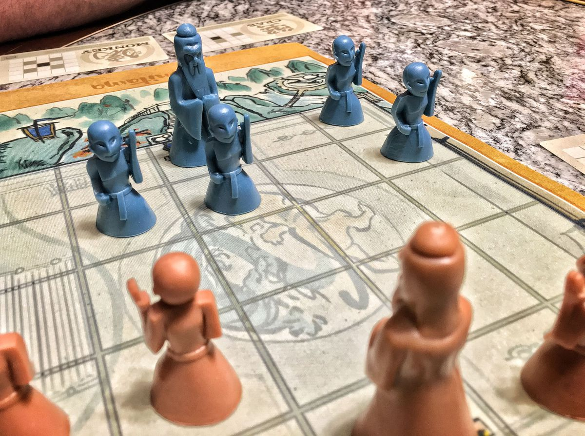
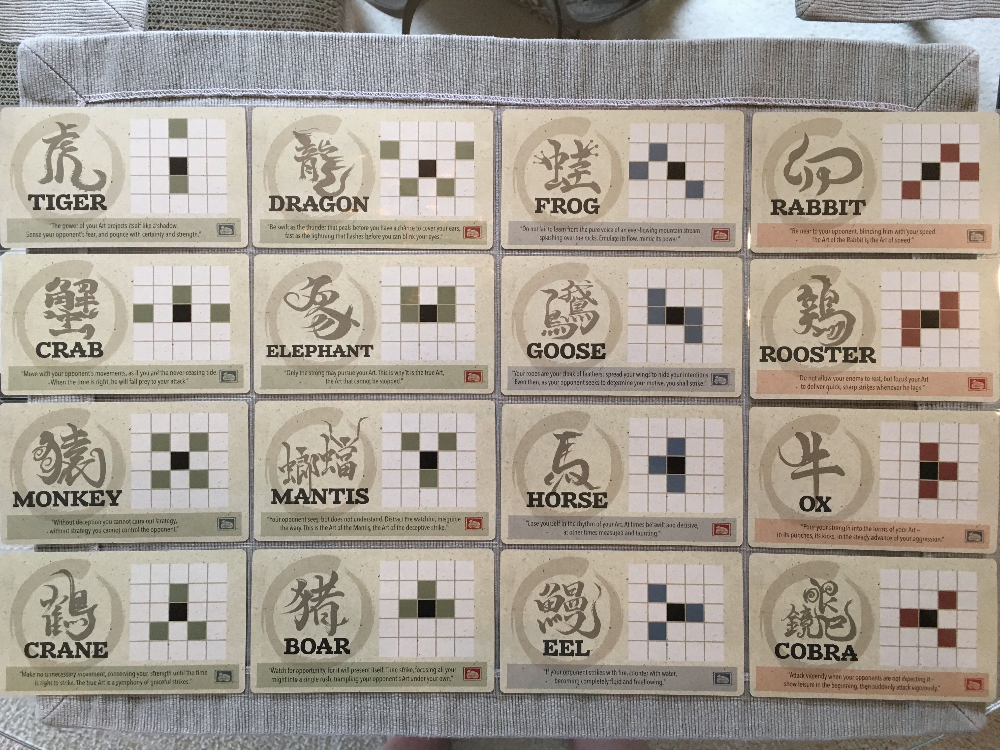

# Onitama AI challenge

For this code club challenge, you will be tasked with writing an AI player for a simple board game. AIs will be matched against each other via a network server to determine the champion!

## The Onitama board game

Onitama is a simple abstract strategy board game. The goal is to either capture the opponent's Master pawn, or to move your own Master across the board. Each turn you will use one of your two movement cards that indicate your valid moves. The twist is that movement cards rotate between the players as they are used, making it a pretty tricky game!

Check the official [rulebook](http://www.arcanewonders.com/resources/Onitama_Rulebook.PDF) for complete rules, and this photo of the 16 available cards:

**Note:** The starting player will be determined randomly, instead of using the method described in the rules. The colored stamps on the cards can be entirely ignored.

**Note 2:** The rules indicate that if you do not have a valid move, you still play a card but do not move a pawn. In practice this situation never happens, so you can ignore it. If by cosmic chance it would, the rule in this competition is instead: if a player has no valid move, they lose. The judge handles this already with the timeout, since no valid move can be submitted in time.

## The judge

Participants are required to build a program that will communicate with the judge via TCP connections, getting the initial game setup from it and submitting moves as the game progresses.

The following paragraphs describe the protocol.

As a rule, every communication to and from the server is text and ends in a newline character `"\n"`.

### Game setup

The server accepts two TCP connections, and assigns positions and names to the two players: "Top" and "Bottom", then sends them as the following strings:

`You are Top` or `You are Bottom`

The server then randomly draws five cards and informs both players as follows:

`Cards: <top1>,<top2>,<bottom1>,<bottom2>,<middle>`

Card names are capitalized. For instance:

`Cards: Cobra,Eel,Crab,Rabbit,Tiger`

Finally, the server randomly selects a player and informs both players using one of the following strings:

`Top starts` or `Bottom starts`

### Game progress

Any string sent by a player *out of turn* is ignored.

Any string sent by a player *on their turn* is further analyzed.

1. If it does not match the move syntax (see below), it is ignored.
2. If it matches the move syntax, it is checked against valid moves at this stage of the game. If the move is valid, it is applied, and broadcast back to **both** players. If it is invalid, the player is eliminated and the other one wins by default.

When a player submits an invalid move and is eliminated, the server drops both TCP connections.

To summarize, when a player, on their turn, sends a line to the server, there are three possible outcomes:

1. It is ignored (not a move)
2. It is applied (valid move), and sent back as a confirmation
3. The connection drops (invalid move, game over)

### Move syntax

The cells of the 5x5 board are denoted using the following notation:

1. one letter for the column (a to e, from left to right)
2. one digit for the row (1 to 5, from top to bottom)

| a1     | b1     | c1     | d1     | e1     |
|:-------|:-------|:-------|:-------|:-------|
| a2     | b2     | c2     | d2     | e2     |
| a3     | b3     | c3     | d3     | e3     |
| a4     | b4     | c4     | d4     | e4     |
| **a5** | **b5** | **c5** | **d5** | **e5** |

With this notation, Top's pawns start on row 1, and Bottom's pawns start on row 5.

The server accepts moves (and broadcasts them) following this format:

`<card> <origin> <destination>`

For instance:

`Cobra a5 b4`

### Timeout

On their turn, players have a fixed amount of time to send their move. After that time has elapsed, the player is forfeit and loses the game.

In that event, the server drops both connections.

The turn duration will be set according to the competition's parameters, but an order of magnitude would be from a few seconds to a minute.

### Endgame

When the game reaches an end state (one player won), the server drops both connections.

### Implementation

The judge's implementation is shared with the participants and can serve as a reference implementation of the game logic.

1. `onitama.lua` is the game logic
2. `judge.lua` is the judge server

This exact program will be used during the competition.

Requirements:

- Lua 5.1 or above
- luasocket

Usage:

`lua judge.lua <port> <timeout>`

(timeout is in seconds)

## Competition

The competition mode is yet to be determined. Depending on the number of participants, a single-elimination bracket or Swiss-style tournament could be used.

Timeouts could be for instance 20 seconds in most games, and 1 minute for the finals.

Each match can consist in 3 games to account for the randomness of the starting position.
